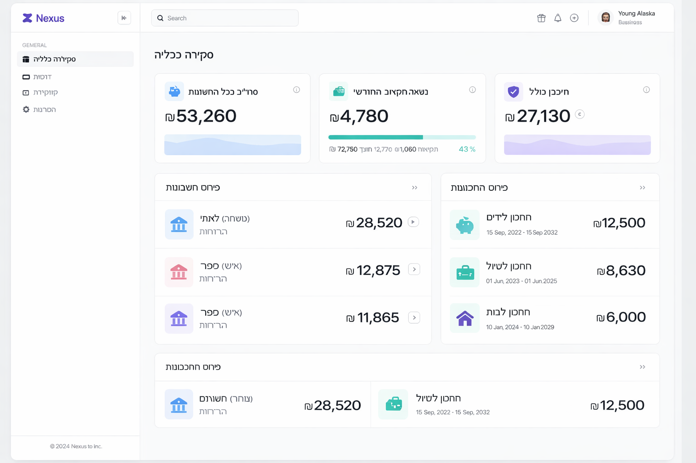
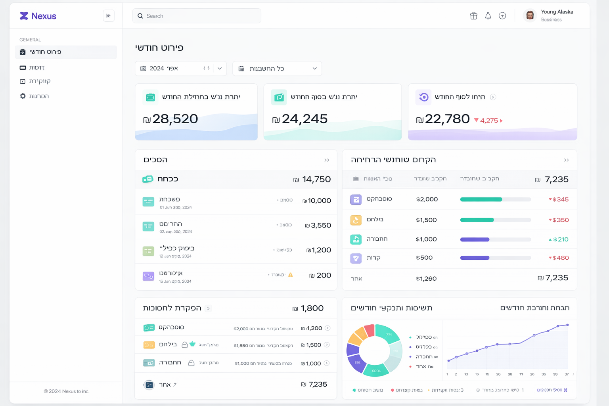
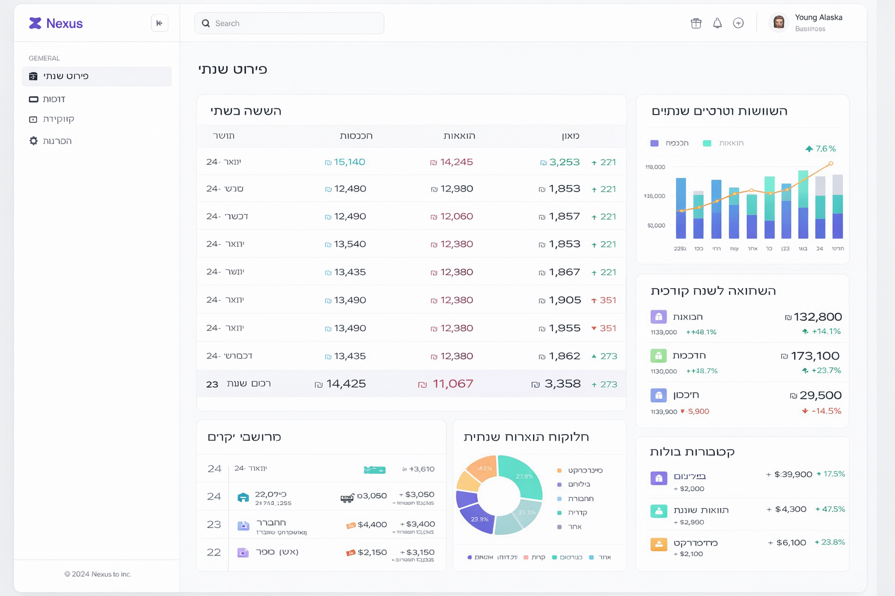
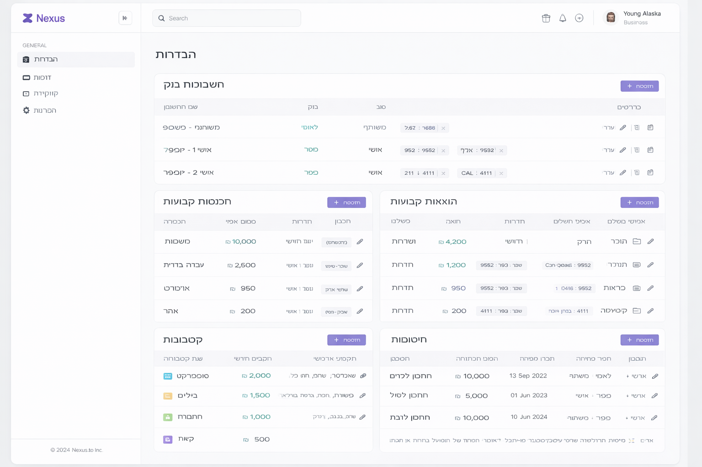

# Screen Plan

## Screen 1: Overview (Dashboard)

**Purpose:** Instant snapshot of all our money.

### Top Section — Key Figures
- **Total across all accounts** — prominent number summing all balances
- **Remaining monthly budget** — difference between defined budget and expenses so far
- **Total savings** — sum of all savings

### Account Breakdown
- For each bank account: account name, current balance
- Accounts: Leumi (shared), Pepper (personal 1), Pepper (personal 2)

### Savings Breakdown
- For each saving: name, current amount, open date, maturity date

### Mockup

---

## Screen 2: Monthly View

**Purpose:** Full understanding of what's happening with money in a selected month.

### Filters
- **Month selector** — navigate between months
- **Account selector** — specific account or "All accounts"

### Monthly Summary
- Opening balance at start of month
- Closing balance at end of month (actual or projected)
- **End-of-month forecast** — based on expected fixed expenses + average variable expenses

### Cash Flow Breakdown (each section expandable)

#### Income
- List of all income items for the month
- Total income

#### Fixed Expenses
- List of fixed expenses (as defined in Settings)
- Indicator whether expense has already been charged or is expected
- Total fixed expenses

#### Savings Deposits
- List of deposits
- Total deposits

#### Variable Expenses (by category)
- For each category: name, total expenses, defined budget, remaining
- Expandable — list of transactions in category
- Flagging of unusual expenses (significantly higher than average)
- Uncategorized transactions
- Distinction between charged and expected charges (based on card billing day)

### Monthly Comparisons & Trends
- **Per category:** how much spent this month vs. average of last 3/6 months
- **Expense trend:** are overall expenses going up or down (arrow + percentage)
- **Previous month comparison:** difference in income, fixed expenses, variable expenses
- **Budget compliance:** how many categories on budget, how many exceeded

### Charts
- Pie — variable expense breakdown by category
- Bar — actual vs. budget per category
- Line — cumulative daily expense trend throughout the month

### Mockup

---

## Screen 3: Yearly View

**Purpose:** Broad view of financial status throughout the year.

### Monthly Table
- For each month: income, expenses, balance (income minus expenses)
- Annual summary row

### Yearly Comparisons & Trends
- **Annual trend:** are expenses/income rising or falling throughout the year
- **Expensive months:** which months were most expensive and why
- **Year-over-year comparison:** expenses, income, savings — this year vs. last year
- **Monthly average:** average income, expenses, and balance
- **Notable categories:** which categories grew the most throughout the year

### Charts
- Grouped bar — income vs. expenses per month
- Line — monthly balance trend throughout the year
- Pie — annual expense breakdown by category

### Mockup

---

## Screen 4: Settings

**Purpose:** Define and update all parameters the app needs to function.

### Bank Accounts
- List of accounts (name, bank, type: personal/shared)
- Add / edit / delete account
- For each account — linked credit cards:
  - Card name, credit card company (Max/Isracard/Cal)
  - Last 4 digits
  - **Billing day** (day of month when charges are processed)

### Fixed Income
- List: income name, expected amount, frequency (monthly/weekly), target account
- Add / edit / delete

### Fixed Expenses
- List: expense name, expected amount, frequency, payment method (credit card/standing order/other)
- Add / edit / delete

### Variable Expense Categories
- List of categories: name, monthly budget
- For each category — **automatic classification rules**: list of keywords (e.g., "Shufersal", "Rami Levy" → Food)
- Add / edit / delete categories
- Default category for unrecognized transactions

### Savings
- List of savings: name, initial amount, open date, maturity date, account
- Add / edit / delete

### Mockup

---

## Screen 5: Wedding Planner — Temporary

**Purpose:** Full management of wedding budget, vendor payment tracking, and forecasting whether we'll stay within budget.

> Temporary screen — will be removed after the wedding.

### Top Summary
- **Total wedding cost** — sum of all vendors
- **Paid so far** — total advances and payments made
- **Remaining to pay** — the difference
- **Original budget vs. actual** — over or under budget

### Vendor & Payment Tracking
- For each vendor:
  - Vendor name
  - Category (venue, photographer, DJ, dress, flowers, invitations, etc.)
  - Total cost
  - Payment schedule:
    - Advance: amount, date, paid ✓/✗
    - Interim payment: amount, date, paid ✓/✗
    - Final payment: amount, date, paid ✓/✗
  - Notes (e.g., "need to confirm final menu before payment")
- Alert for upcoming payments
- Add / edit / delete vendors

### Guest Tracking & Expected Income
- Total invited
- Confirmed attendance
- Declined
- Not yet responded
- **Estimated gift income:** expected average per guest × confirmed count
- Option to adjust expected average per guest

### Calculator — "Can We Afford This?"
**Expected Income:**
- Current account balances (pulled automatically from data)
- Expected salaries until the wedding (number of months × monthly income from Settings)
- Estimated gifts (from guest tracking)
- Additional income (manual input)

**Expected Expenses:**
- Regular living expenses until the wedding (number of months × average monthly expenses)
- Remaining vendor payments
- Additional expenses (manual input)

**Result:**
- **Projected balance before the wedding**
- **Projected balance after the wedding**
- Green/yellow/red indicator based on status

### Charts
- Pie — wedding cost breakdown by vendor category
- Bar — budget vs. actual per category
- Timeline — expected payments over the months leading to the wedding

### Mockup

